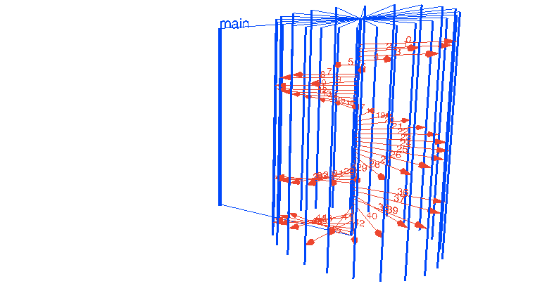

# requests
A package utility that lets me make various requests in Go

### The Requestor Interface
```go
type Requestor interface {
    Request()
}
```
A `Requestor` is any object type that implements a Request() method to make HTTP requests.
Types that satisfy this interface are allowed to be passed into RequestPools


### Request Pool
```go
type RequestPool struct {
	wg         *sync.WaitGroup
	requestors []Requestor
	channel    chan Requestor
}

```
A `RequestPool` represents a pool of concurrent HTTP requests. When given an array of Requestors,
the RequestPool will spawn a worker thread for each Requestor present. The Requestor will then
make its request while inside the worker thread.

RequestPool's implementation makes use of a common concurrency pattern called Fan-Out/Workers.
A visualization of the pattern looks like this:



